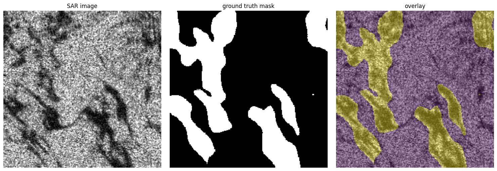
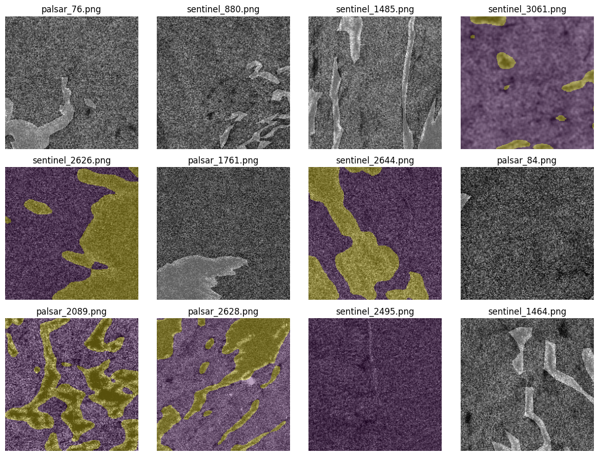
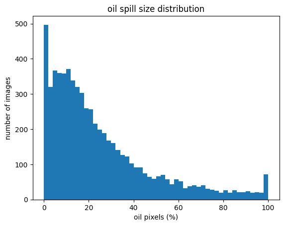

# Oil Spill Detection Prototype

Dataset: [zenodo.org/records/15298010](https://zenodo.org/records/15298010)


## Information about the data:
| **type** | **loc** | **n** |
|----------|---------|-------|
| images   | train   | 6455  |
| masks    | train   | 6455  |
| images   | val     | 1615  |
| masks    | val     | 1615  |

```
Images in train:
Images without masks: 0
Masks without images: 0
Pass!

Images in val:
Images without masks: 0
Masks without images: 0
Pass!

train:
  total:       6455
  binary:      4608
  antialiased: 1847
val:
  total:       1615
  binary:      1615
  antialiased: 0
```

## Samples

One file (antialiased mask):




Sample grid (masks, overlaid on SAR images):




Oil spill size distribution across images:

